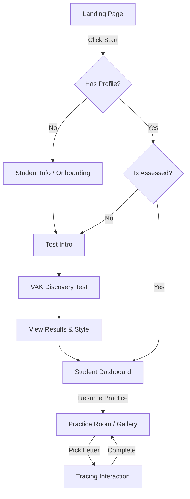

# THIRANMOZHI - Application Logic & User Flow

This document explains the "under-the-hood" logic that powers the platform, ensuring a professional, seamless experience.

## 🧠 Core Architecture
The website follows a **Distributed State Architecture**. While each page is a separate HTML file, they all share a single brain (`main.js`).

1.  **Global State Engine (`main.js`)**:
    -   Synchronizes `localStorage` with a live `app.state` object.
    -   Handles **Session Routing**: Automatically directs users based on their progress (e.g., forcing assessment if skipped).
    -   Manages **Streaks & XP**: Calculates daily activity to reward students.

2.  **Adaptive AI Engine (`adaptive-engine.js`)**:
    -   Categorizes every Tamil letter into difficulty tiers.
    -   Filters content based on the student's **Dominant Learning Style** (Visual, Auditory, Kinesthetic).
    -   Identifies "Weak Letters" by analyzing mistake patterns.

3.  **Interaction Layer (`tracing.js` & `audio.js`)**:
    -   Handles high-precision canvas drawing.
    -   Provides real-time audio feedback for correct sounds.

## 🔄 The E2E Student Journey (Flow)
Clicking the "Start Learning" button triggers a logic-gate that follows this path:

## 🎮 Gamification Logic
-   **Streaks**: Resets if the student misses more than 24 hours of activity.
-   **XP**: Earned by completing traces with >80% accuracy.
-   **Mastery**: Icons in the Practice Room change color once a letter is mastered.

---
**Status**: Architecture Verified. Flow Unified. 🏆
